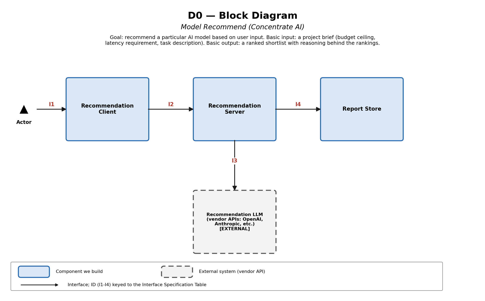
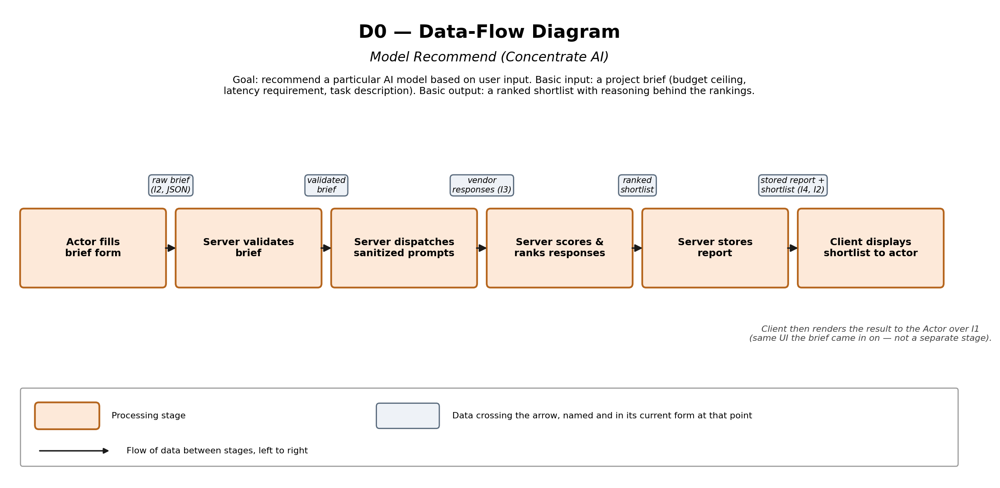

# D0 — High-Level Design

**Project:** Model Recommend (Concentrate AI)
**Team:** Allison Oh, Aditya Pawar

## 1. Title, Goal Statement, and Conventions

**Title:** Model Recommend — D0 High-Level Design

**Goal statement:** The goal of the project is to recommend a particular AI model based on user input.

**Basic input / output:** The basic input to the system is a project brief specifying budget ceiling, latency requirement, and a task description. The basic output is a ranked shortlist with reasoning behind the rankings.

**Conventions (shown as a legend on both diagrams):** A solid blue box is a component the team builds. A dashed gray box is an external, third-party system the team depends on but does not build. Each line is an interface, labeled with an ID (I1-I4) that keys into the Interface Specification Table in Part 4; on the data-flow diagram, arrow labels instead name the data crossing them and its form at that point.

## 2. Block Diagram (D0)

See [D0_High_Level_Design.drawio](D0_High_Level_Design.drawio) and `D0_block_diagram.png` (rendered).



The diagram shows three components the team builds — Recommendation Client, Recommendation Server, and Report Store — plus one external dependency (Recommendation LLM, standing in for the vendor APIs that generate a recommendation, drawn dashed). An Actor (the person using the system) is shown outside the system boundary per standard UML convention.

## 3. Component Responsibility Table

| Component | Responsibility (one sentence) | Interfaces In | Interfaces Out | Owner |
|---|---|---|---|---|
| Recommendation Client | Presents the project-brief form to the actor and displays the ranked recommendation with its reasoning. | I1, I2 | I1, I2 | Allison Oh |
| Recommendation Server | Validates the submitted brief, dispatches sanitized prompts to the vendor LLMs, and scores the responses into a ranked list. | I2, I3, I4 | I2, I3, I4 | Aditya Pawar |
| Report Store | Persists each client's recommendation report so it can be retrieved later. | I4 | I4 | Allison Oh |
| Recommendation LLM *(external)* | Returns a benchmark completion for each sanitized sample prompt it receives. | I3 | I3 | N/A — third-party |

## 4. Interface Specification Table

| ID | From ↔ To | Input (named, typed) | Output (named, typed) | Format | Protocol | On error | Handled by |
|---|---|---|---|---|---|---|---|
| I1 | Actor ↔ Recommendation Client | Form fields: `budget` (USD), `latency_ms` (integer), `task_description` (string) | Rendered shortlist view (model names, fit reasoning) | HTML form / rendered page | In-browser UI (not a network API) | Inline field validation in the browser before the form can submit to I2. | Recommendation Client |
| I2 | Recommendation Client ↔ Recommendation Server | `project_brief` {budget: number, latency_ms: integer, task_description: string} | `shortlist_response` {models: array of {name, fit_score, reasoning}} | JSON | REST over HTTPS | Server returns HTTP 400 with a field-level message; Client displays it inline and does not resubmit automatically. | Recommendation Server |
| I3 | Recommendation Server ↔ Recommendation LLM *(external)* | `sample_prompt` {prompt_text: string (sanitized), max_tokens: integer} | `vendor_response` {latency_ms: integer, cost_usd: number, completion_text: string} | JSON over HTTPS | REST (HTTPS, vendor-specific auth) | On a rate-limit error, the Server pauses that vendor and marks it "delayed" rather than failing the whole request; on any other error it retries once, then marks that vendor "unavailable" for this run. | Recommendation Server |
| I4 | Recommendation Server ↔ Report Store | `store_request` {client_id, models, generated_at} or `report_request` {client_id, report_id} | `store_ack` {report_id, status} or `report_data` {models, generated_at} | JSON | Internal RPC (HTTPS) | If the write fails, the Server retries once, then returns the shortlist to the Client marked "not yet saved" instead of silently losing it. | Report Store |

**Example payload (I3 request, Server → a vendor LLM):**

```json
{
  "prompt_text": "Summarize the attached support ticket in two sentences.",
  "max_tokens": 120
}
```

**Example payload (I3 response):**

```json
{
  "latency_ms": 842,
  "cost_usd": 0.0031,
  "completion_text": "The customer's login fails after a password reset..."
}
```

## 5. Data-Flow Diagram

See `D0_High_Level_Design.drawio` (editable source, Page 2) and `D0_dataflow_diagram.png` (rendered).



The brief moves stage by stage: the actor fills in the brief form; the Server validates it; the Server dispatches sanitized sample prompts to the vendor LLM(s) over I3; the Server scores and ranks the responses; the Server stores the report via I4; and the Client displays the ranked shortlist back to the actor (closing the loop over I1/I2).

This diagram covers the recommendation path. Vendor-approval/compliance review and platform rate-limit handling are treated as internal behavior of the Recommendation Server at this structure-only level of detail, rather than as separate D0 stages; they will be elaborated at the algorithm level in D1.

## 6. Architecture Pattern and Justification

**Pattern chosen:** A **client-server** architecture — the Recommendation Client as the presentation layer, the Recommendation Server as the single logic/orchestration layer, with a lightweight **pipeline** inside the Server itself (validate → dispatch → score, run as ordered steps rather than one undifferentiated block of code).

**Justification against the five criteria:**

- **Fit to the problem:** The problem is a request/response interaction (the actor asks for a recommendation, the system answers), which is exactly what client-server is for; the internal benchmarking step is a short sequence of transformations, which a lightweight pipeline handles without over-engineering it into separate services.
- **Team skills:** A two-person team (Aditya as Lead Developer/Architect, Allison as Documentation/Coordinator with a UI-facing role) can build and debug a single client and a single server; neither member has prior experience operating multiple independently deployed backend services.
- **Performance and timing:** The system inherits the 90-second shortlist-generation budget from AC-01.1. A single-server pipeline keeps the dispatch-to-vendor step and the scoring step independent enough to optimize later without a rewrite.
- **Scalability:** Concentrate AI funds cloud and API costs on an as-needed basis rather than a fixed cap, so the system does not need to scale to heavy concurrent load on day one; a single server can be scaled by adding instances later if needed.
- **Hardware constraints:** None — the system runs entirely as client and server software reachable over HTTPS; no embedded or sensor/actuator constraints apply.

**Pattern rejected:** A microservices split (separate independently-deployed services for validation, dispatch, and scoring) was considered and rejected. It would add service discovery, inter-service auth, and separate deployment pipelines that a two-person team doesn't have the bandwidth to build and operate within the course timeline, for a benefit (independent scaling of each step) the project doesn't need yet given Concentrate AI's as-needed, not-yet-heavily-loaded budget.

## 7. Decision Log

**D-01 — Split "Report Store" out of the Server, rather than having the Server persist its own output.**
Alternatives considered: (a) have the Server read/write its own report data directly, with no separate component; (b) a dedicated Report Store component.
Chosen: (b), because the Server's original one-line responsibility ("validate, dispatch, score, *and* store") needed an "and" too many to describe — exactly the smell the assignment asks us to watch for — and a shared store lets a client request retrieve a past report (I4) independent of whether the Server is mid-run on a new one.

**D-02 — Draw "Recommendation LLM" as a single external box standing in for multiple vendor APIs, rather than naming each vendor separately on the diagram.**
Alternatives considered: (a) one box per vendor (OpenAI, Anthropic, etc.) on the block diagram; (b) one external box representing all of them, with vendor names listed in its label and detailed in the Interface Specification Table instead.
Chosen: (b), to keep the D0 diagram at the "structure, not detail" level the assignment asks for — which vendors are involved and how many is closer to a D1/algorithm-level decision.

**D-03 — A single Recommendation Server, not separate services per pipeline step (validate / dispatch / score).**
Alternatives considered: (a) one service per step (three small services); (b) one Server with three internal steps.
Chosen: (b), because the team's size and the course timeline don't support operating three deployed services, and nothing about the current requirements needs them scaled independently yet (see Pattern Justification, Part 6).

**D-04 — Treat the Actor as outside the system boundary rather than as a counted "component."**
Alternatives considered: (a) count the Actor as one of the four-to-eight block-diagram components; (b) show the Actor as an external stakeholder per standard UML convention, counting only the four built/external system boxes toward the range.
Chosen: (b), following standard UML convention, and because the assignment's examples of "components" (an identity provider, a third-party API, a hardware platform) are systems, not people.

**D-05 — Treat vendor-approval (US-04) and rate-limit-alerting (US-05) as internal Server behavior at D0, rather than adding new boxes for them.**
Alternatives considered: (a) add an IT-reviewer actor and a dedicated Vendor Policy component to model US-04, plus a separate notification path for US-05; (b) keep both as internal Server behavior, documented at the algorithm level in D1.
Chosen: (b), to keep D0 at the structure-only level the assignment asks for; both stories still trace to the Recommendation Server, which owns the interface (I3) they affect.
