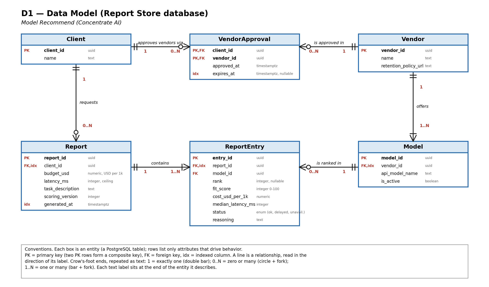

# D1 — Detailed Design

**Project:** Model Recommend (Concentrate AI)
**Team:** Allison Oh, Aditya Pawar

## 1. Header, Scope, and Conventions

**Title:** Model Recommend — D1 Detailed Design

**Goal statement:** The goal of the project is to recommend a particular AI model based on user input.

**Scope:** This document details the **Recommendation Server** (request validation, benchmark dispatch, scoring, and public API) and the **Report Store** (the persistent data model); the Recommendation Client and the external Recommendation LLM are deferred to D2.

**Conventions (apply to the one figure in this document, Part 2):** Each box is an entity, which becomes one PostgreSQL table; a box lists only the attributes that drive behavior, not every column. In each row, **PK** marks a primary key (two PK rows in one box form a composite key), **FK** marks a foreign key, and **idx** marks an indexed column; the remaining text is the column's type. Each line is a relationship, read in the direction of its italic label. Cardinality is drawn at both ends of every line in crow's-foot notation and repeated as text: **1** is exactly one (double bar), **0..N** is zero or many (circle and fork), and **1..N** is one or many (bar and fork). The cardinality label sits at the end of the entity it describes. Requirement IDs (US-nn, AC-nn.n) refer to *User_Stories.md*; interface IDs (I1–I4) and decision IDs (D-nn) refer to *D0_High_Level_Design*.

## 2. Data Model



Editable source: `D1_data_model.drawio`. The model belongs to the Report Store, which holds every piece of state the Server needs to persist: finished recommendation reports, the vendor and model catalog, and each client's approved vendor list.

**Store choice:** A relational model (PostgreSQL). The data has two many-to-one chains (Client → Report → ReportEntry and Vendor → Model → ReportEntry) and one many-to-many relationship (Client ↔ Vendor), and the product depends on queries that follow those joins: "all models of the vendors this client approved" before every run, and "a report with its ranked entries" after it. A document store or flat JSON files would force us to hand-maintain those joins and the uniqueness rules described below.

### Structural decisions

| Decision | Choice | Why | Requirement |
|---|---|---|---|
| ReportEntry is its own entity, not an array attribute on Report | Entity, Report 1 — 1..N ReportEntry | Each ranked model carries its own score, cost, latency, status, and reasoning text; storing them as rows lets us sort by rank, constrain `(report_id, rank)` to be unique, and fetch one model's reasoning without loading the whole report. | US-01, US-02, AC-01.1 |
| Vendor and Model are separate entities, not a vendor-name string on the model | Entity, Vendor 1 — 1..N Model | Approval and data-retention policy attach to the *vendor* (the company that receives the prompt), while ranking attaches to the *model*. One vendor offers several models, so a single column would repeat the policy URL and make "approve a vendor" an update across many rows. | US-04, UC-02 |
| Client ↔ Vendor is many-to-many, resolved through VendorApproval | Association entity with composite PK `(client_id, vendor_id)` | A client approves many vendors, and a vendor is approved by many clients, so neither side can hold the foreign key. The association carries its own data: `approved_at` and a nullable `expires_at` for the 90-day alternate flow. | US-04, AC-02.1, UC-02 alternate flow |
| Client → Report is one-to-many, not many-to-many | A report has exactly one owning client | A report is derived from one client's brief and approved vendors; sharing it across clients would leak the brief. Every read of a report is filtered by the caller's `client_id`. | US-01, US-04 |
| The brief fields are columns on Report, not a separate Brief entity | Attributes `budget_usd`, `latency_ms`, `task_description` | A brief is 1:1 with its report, is never queried on its own, and never changes after the run. A separate table would add a join with no benefit. `budget_usd` means the ceiling in USD per 1,000 requests. | AC-01.1, AC-01.2 |
| ReportEntry stores a snapshot (`cost_usd_per_1k`, `median_latency_ms`, `fit_score`) rather than recomputing from live data | Denormalized copy | Vendor prices and speeds change; a stored report must show what the client saw. `Report.scoring_version` records which weights produced the scores. | US-02 |
| Models are deactivated (`is_active = false`), never deleted | Soft delete | `ReportEntry.model_id` must keep pointing at a row after a vendor retires a model. | US-02 |
| `ReportEntry.rank` is nullable | Null for entries with status `delayed` or `unavailable` | A vendor paused under AC-01.3 still appears in the report with its status but has no score, so it cannot hold a rank. | AC-01.3 |

### Indexes

| Index | Why |
|---|---|
| `reports (client_id, generated_at DESC)` | Serves "list my reports, newest first" (E3) with one index range scan and no sort. |
| `report_entries (report_id, rank)`, unique | Serves "a report's shortlist in order" (E2) and prevents two entries sharing a rank. |
| `vendor_approvals (client_id, vendor_id)` primary key | Serves the lookup run before every benchmark: which vendors may receive this client's prompts. |
| `vendor_approvals (expires_at)`, partial `WHERE expires_at IS NOT NULL` | Lets the daily reminder job find approvals expiring in 7 days without scanning indefinite approvals (UC-02 alternate flow). |
| `models (vendor_id)` | Serves "all active models for these vendors" when building the dispatch list. |

## 3. Core Algorithms

Two computations decide whether the product works. **A1** (benchmark dispatch) decides whether a result arrives inside the 90-second limit at all; **A2** (weighted scoring and ranking) decides whether the result is right.

### A1. Parallel benchmark dispatch with per-vendor rate-limit handling

**What it is and the problem it solves.** The Server must collect, for every approved model, several sample completions and then grade them, all inside the 90-second limit of AC-01.1. A1 sends those calls to the vendors concurrently, keeps one independent queue per vendor, and, when a vendor starts returning rate-limit errors, pauses only that vendor so the others keep going (AC-01.3).

**Inputs and outputs.**

- Inputs: `models`: array of {`model_id`: uuid, `vendor_id`: uuid, `api_model_name`: string}, drawn from active models of the client's currently approved vendors; `prompts`: array of P sanitized prompt strings derived from `task_description` (default P = 5, string length ≤ 2,000); `concurrency_per_vendor`: integer (default 4); `deadline_ms`: integer (default 80,000).
- Outputs: `samples`: array of {`model_id`: uuid, `latency_ms`: integer, `cost_usd`: number, `grade`: number in [0, 1]}, and `vendor_status`: map from `vendor_id` to `"ok"` | `"delayed"` | `"unavailable"`.

**How it works.** Each vendor gets its own limiter (a queue that allows at most `concurrency_per_vendor` calls in flight), and all vendors run in parallel. A call that returns HTTP 429 increments that vendor's consecutive-429 counter; any success resets it. When the counter reaches 2, the vendor's state flips to `delayed` immediately (inside the 5-second window of AC-01.3), its queued calls are dropped, and no new call goes to it until 60 seconds have passed or the `Retry-After` header says otherwise, whichever is longer. Any other error is retried once; a second failure counts that sample as failed. A model needs at least 3 successful samples to be scored; a vendor whose models all fall short is `unavailable`. At `deadline_ms` all in-flight calls are aborted and whatever has completed is passed to A2, which leaves roughly 10 seconds for scoring and the report write. Each completion is graded by one fixed grader call on a 1–5 rubric, normalized to [0, 1] as (g − 1) / 4; the grader model is always chosen from the client's approved vendors, so a completion is never sent to an unapproved vendor (US-04).

**Expected complexity at realistic size.** Realistic size is 4 approved vendors, 10 models, and P = 5 prompts, which is N = 50 benchmark calls plus 50 grading calls, 100 vendor calls per run. Computation inside the Server is O(N) and negligible; wall-clock time is dominated by vendor latency. With about 25 calls per vendor and 4 in flight, that is roughly 7 rounds of about 4 seconds each, about 30 seconds, comfortably inside 90. Sending the same 100 calls one at a time would take about 400 seconds and break AC-01.1. At 100× the load (100 concurrent runs, about 10,000 vendor calls in a burst) the CPU cost is still trivial, but vendor rate limits become the binding constraint. For that reason the per-vendor limiter is shared across all runs in the process rather than created per run, so concurrent runs queue behind one limit instead of each triggering 429s. Whether 4 in flight is the right number has not been measured; it is a default to tune against real vendor limits, not a claim.

**Why this approach rather than the alternatives.** (a) *Sequential dispatch* is simplest but takes about 400 seconds at realistic size. (b) *One global worker pool* is simple, but one vendor's rate-limit pause would stall calls to every other vendor, violating AC-01.3's requirement that the remaining vendors continue. (c) *A message queue with background workers* would survive a Server restart but adds a broker to operate and a polling round-trip for the Client, for a run that lasts under 90 seconds. Per-vendor limiters give the isolation of (b)-done-right with no new infrastructure.

**Edge cases.**

| Case | Behavior |
|---|---|
| No approved vendors (empty list or all approvals expired) | Reject before any dispatch with `409 no_approved_vendors`; no prompt leaves the system (UC-02 exception flow, AC-02.2). |
| Approved vendors have no active models | Same `409 no_approved_vendors`. |
| Duplicate `model_id` in the dispatch list, or duplicate prompt strings | Deduplicate before dispatch so no call is paid for twice. |
| Completion is empty, or the vendor omits cost | That sample counts as failed; it is never scored as zero. |
| 429 with a `Retry-After` longer than 60 seconds | Pause for the longer value; the vendor stays `delayed` for this run. |
| All vendors `delayed` or `unavailable` | Return `503 all_vendors_unavailable`; no report is stored. |
| Client disconnects mid-run | Abort in-flight calls to stop spending vendor budget. |
| Deadline reached with some vendors incomplete | Score what exists; incomplete models are `unavailable`; the report carries a warning. |

### A2. Weighted multi-criteria scoring and ranking

**What it is and the problem it solves.** Turns the raw samples into the ranked shortlist with a 0–100 fit score and a plain-language reason for each position (US-01, US-02).

**Inputs and outputs.**

- Inputs: `samples` from A1 (at least 3 per ranked model); `budget`: number, USD ceiling per 1,000 requests, B > 0; `latency_ms`: integer ceiling, L_max > 0; weights `w_q = 0.5`, `w_c = 0.3`, `w_l = 0.2`, which sum to 1 and are identified by `scoring_version = 1`.
- Outputs: array of {`rank`: integer or null, `name`: string, `vendor`: string, `fit_score`: integer 0–100 or null, `cost_usd_per_1k`: number, `median_latency_ms`: integer, `within_limits`: boolean, `status`: string, `reasoning`: string}.

**How it works.** For each model: quality q is the mean grade of its samples; projected cost p is 1,000 × the mean `cost_usd`; latency L is the median `latency_ms`. Then `s_cost = max(0, 1 − p / B)` and `s_lat = max(0, 1 − L / L_max)`, and `fit_score = round(100 × (w_q·q + w_c·s_cost + w_l·s_lat))`. A model is `within_limits` when p ≤ B and L ≤ L_max. Models are sorted by this key, in order: `within_limits` (true first), `fit_score` descending, `p` ascending, `name` ascending. Ranks are 1..k for ranked models; `delayed` and `unavailable` models are appended after them with null rank and score. The `reasoning` string is a fixed template filled with the model's own numbers (for example, "Quality 0.82; projected $1.90 per 1,000 requests (63% of your $3.00 ceiling); median latency 842 ms (42% of your 2,000 ms ceiling)."), so the same input always produces the same explanation.

**Expected complexity at realistic size.** With M = 10 models and P = 5 samples each, the work is O(M·P + M log M), about 50 reads and one sort of 10 items, well under a millisecond. At 100× (1,000 models) it is still under a few milliseconds. The difference does not matter; the time budget is spent in A1, not here, so A2 gets no optimization work.

**Why this approach rather than the alternatives.** (a) *Filter-then-rank* (drop every model over budget or latency, then rank the rest) is simple, but when a client's limits are tight it can leave fewer than the 3 models AC-01.1 requires and hides near-misses a client might accept; weighting keeps them visible, flagged `within_limits = false`. (b) *Pareto front only* returns the non-dominated models but no single ordering and no 0–100 score, which AC-01.1 requires. (c) *A learned ranker* needs labelled preference data we do not have, and its output could not be explained to the client's leadership as US-02 requires. (d) *AHP or TOPSIS* adds pairwise-comparison or distance-to-ideal machinery that, with only three criteria, produces the same ordering as a weighted sum at a higher explanation cost.

**Edge cases.**

| Case | Behavior |
|---|---|
| Fewer than 3 rankable models | Return what exists and add warning `fewer_than_3_models`; never pad with unscored entries. |
| All models exceed the budget or latency ceiling | Still ranked, all `within_limits = false`; reasoning states which ceiling each one misses. |
| Tied `fit_score` | Resolved deterministically by cost, then name, so repeated runs on the same data produce the same order. |
| Even number of samples | Median is the mean of the two middle values. |
| `p / B` or `L / L_max` exceeds 1 | The sub-score clamps at 0; it never goes negative. |
| `budget` ≤ 0 or `latency_ms` ≤ 0, or a missing field | Never reaches A2: rejected upstream by validation with `400 invalid_brief` and no dispatch (AC-01.2). |
| Weights do not sum to 1 | The Server refuses to start; weights are configuration, not request input. |

## 4. Build-versus-Reuse Decisions

Every library below was checked for maturity (current release line and maintenance activity), license, performance fit for our scale, and fit with the TypeScript/Node stack. Versions were read from the npm registry when this document was written.

| Piece | Build or Reuse | Library or service | License | One-line reason |
|---|---|---|---|---|
| HTTP server and routing | Reuse | Fastify 5 | MIT | Mature, low overhead, built-in JSON-schema hooks and first-class TypeScript support; Express offers no advantage here. |
| Request/response validation | Reuse | zod 4 | MIT | One schema gives both runtime validation and the TypeScript type; produces the field-level errors AC-01.2 needs. |
| Per-vendor concurrency limiter (A1) | Reuse | p-limit 7 | MIT | Small, widely used, does exactly one thing; a hand-written queue would add bugs and no value. |
| Retry of failed vendor calls (A1) | Reuse | p-retry 8 | MIT | Covers the "retry once" rule without custom timer code. |
| Vendor API clients (I3) | Reuse | `openai` (Apache-2.0) and `@anthropic-ai/sdk` (MIT), official SDKs | Apache-2.0 / MIT | Maintained by the vendors, handle auth and typed 429s; one thin adapter per vendor normalizes them to our `vendor_response` shape. |
| Token verification | Reuse | jose 6 | MIT | Standards-based JWT verification; we do not hand-roll authentication, and token issuance is delegated to an external identity provider. |
| Database engine | Reuse | PostgreSQL | PostgreSQL License (permissive) | Relational model, constraints, and partial indexes the data model needs; decades of production use. |
| Database access | Reuse | Kysely 0.29 with `pg` 8 | MIT | Type-safe SQL builder that keeps our schema visible in code. Prisma was evaluated and passed over because its current release line is a release candidate, which fails our maturity check. |
| Schema migrations | Reuse | node-pg-migrate 9 | MIT | Versioned, reversible SQL migrations; avoids hand-written setup scripts. |
| Structured logging | Reuse | pino 10 | MIT | Fast JSON logs for tracing each vendor call. |
| Test runner | Reuse | vitest | MIT | TypeScript-native; fast enough to run A2's unit tests on every save. |
| Weighted scoring and ranking (A2) | Build | Array sort (built in) plus about 60 lines of our own code | N/A | This is the project-specific logic; no library encodes our criteria. Sorting and median arithmetic use built-ins. |
| Reasoning-text template | Build | None | N/A | The wording is the product's explanation to the client (US-02). |
| Prompt sanitization | Build | None (initial rule set) | N/A | A small, task-specific rule set (strip emails and phone numbers) is enough for D1; a dedicated PII-detection library is a candidate for D2. |
| Hosting runtime and managed Postgres | Reuse | Managed container platform with managed PostgreSQL | Service terms | Avoids running our own servers; see Part 6. |

## 5. API Contract

The Recommendation Server exposes four public endpoints to the Client over I2. All requests carry `Authorization: Bearer <JWT>`; the caller's `client_id` and role come from the token, never from the request body. All bodies and responses are JSON (`Content-Type: application/json`); timestamps are ISO-8601 UTC strings; money is USD; latency is milliseconds.

### Public endpoints (I2)

| Endpoint | Inputs | Outputs | Errors |
|---|---|---|---|
| **E1** `POST /v1/recommendations` | Body: `budget` (number, required, 0.01–10,000, USD ceiling per 1,000 requests); `latency_ms` (integer, required, 100–60,000); `task_description` (string, required, 10–2,000 characters) | `200`: `{report_id: uuid string, generated_at: string, save_status: "saved" \| "not_saved", models: Model[], warnings: string[]}` where `Model` = `{rank: integer \| null, name: string, vendor: string, fit_score: integer 0–100 \| null, cost_usd_per_1k: number \| null, median_latency_ms: integer \| null, status: "ok" \| "delayed" \| "unavailable", within_limits: boolean \| null, reasoning: string}` | `400 invalid_brief` (a required field is missing or out of range; body names the field, no dispatch, AC-01.2); `401 unauthorized` (missing or invalid token); `409 no_approved_vendors` (client has no active approved vendor list); `429 rate_limited` (client exceeded request quota; `Retry-After` header in seconds); `503 all_vendors_unavailable` (every approved vendor delayed or unavailable); `500 internal_error` |
| **E2** `GET /v1/reports/{report_id}` | Path: `report_id` (uuid, required) | `200`: the E1 response shape plus `brief`: `{budget: number, latency_ms: integer, task_description: string}` | `400 invalid_id` (not a uuid); `401 unauthorized`; `404 report_not_found` (no such report, or it belongs to another client; the two cases are deliberately indistinguishable) |
| **E3** `GET /v1/reports` | Query: `limit` (integer, optional, 1–100, default 20); `cursor` (string, optional, opaque value from a previous response) | `200`: `{reports: [{report_id: uuid, generated_at: string, budget: number, latency_ms: integer, top_model: string \| null}], next_cursor: string \| null}` | `400 invalid_limit` / `400 invalid_cursor`; `401 unauthorized` |
| **E4** `PUT /v1/approved-vendors` | Body: `vendor_ids` (array of uuid, required, 1–50 items); `expires_at` (string, optional, future time no more than 90 days away; omitted means no expiry) | `200`: `{vendor_ids: uuid[], approved_at: string, expires_at: string \| null}`; replaces the client's whole list and is active immediately (AC-02.1) | `400 at_least_one_vendor_required` (empty list; message "at least 1 vendor required", AC-02.2); `400 invalid_expiry`; `401 unauthorized`; `403 reviewer_access_required` (token lacks the reviewer role); `404 unknown_vendor` (body lists the unknown ids) |

### Internal methods (I4, Server ↔ Report Store)

The Report Store is a PostgreSQL database reached from the Server over TLS using the PostgreSQL wire protocol; the five methods below are the repository functions the Server calls.

| Method | Inputs | Outputs | Errors |
|---|---|---|---|
| `storeReport(report)` | `report`: {client_id: uuid, brief, scoring_version: integer, entries: Entry[]}; written in one transaction | `{report_id: uuid, status: "saved"}` | `WriteFailed` (database unreachable or constraint violated); the Server retries once, then returns the shortlist with `save_status: "not_saved"` |
| `getReport(client_id, report_id)` | both uuid | report with entries ordered by rank | `NotFound` (maps to `404 report_not_found`) |
| `listReports(client_id, limit, cursor)` | uuid, integer 1–100, string or null | page of report summaries plus next cursor | `InvalidCursor` |
| `getApprovedModels(client_id)` | uuid | active models whose vendor approval exists and has not expired | none; an empty array means no approved vendors |
| `putApprovals(client_id, vendor_ids, expires_at)` | uuid, uuid[], timestamp or null | `{approved_at: timestamp}` | `UnknownVendor` |

### Example (E1)

Request:

```http
POST /v1/recommendations HTTP/1.1
Authorization: Bearer eyJhbGciOi...
Content-Type: application/json

{
  "budget": 3.00,
  "latency_ms": 2000,
  "task_description": "Summarize customer support tickets into two sentences."
}
```

Response:

```json
{
  "report_id": "8d1f3c52-6a7e-4c1b-9d0e-2f5b7a41c9aa",
  "generated_at": "2026-10-08T15:42:07Z",
  "save_status": "saved",
  "models": [
    {
      "rank": 1,
      "name": "model-a",
      "vendor": "Vendor One",
      "fit_score": 64,
      "cost_usd_per_1k": 1.90,
      "median_latency_ms": 842,
      "status": "ok",
      "within_limits": true,
      "reasoning": "Quality 0.82; projected $1.90 per 1,000 requests (63% of your $3.00 ceiling); median latency 842 ms (42% of your 2,000 ms ceiling)."
    },
    {
      "rank": null,
      "name": "model-b",
      "vendor": "Vendor Two",
      "fit_score": null,
      "cost_usd_per_1k": null,
      "median_latency_ms": null,
      "status": "delayed",
      "within_limits": null,
      "reasoning": "This vendor returned rate-limit errors twice in a row and is paused for 60 seconds; it was not scored."
    }
  ],
  "warnings": ["fewer_than_3_models"]
}
```

**Versioning.** The API version is the path prefix (`/v1`); a breaking change is removing or renaming a field, changing a field's type or unit, narrowing a valid range, or adding a new required request parameter, and any such change ships as `/v2` while `/v1` keeps working until the Client has moved; adding an optional request field or a new response field is not breaking.

## 6. Technology Choices with Justification

The five criteria are team skill fit, licensing, community support, performance, and cost and hosting.

**Database: PostgreSQL.** The team already works in PostgreSQL, so the schema in Part 2 can be written, queried, and debugged without a learning curve (skill fit). It is released under the permissive PostgreSQL License, so there is no copyleft or per-seat obligation on Concentrate AI (licensing). Its documentation, driver ecosystem, and answered-question volume are among the largest of any database, and every managed host supports it (community support). At 10⁴–10⁵ rows it answers each query in Part 2 from an index in milliseconds, with large headroom at 100× (performance). Managed Postgres is available on usage-based plans, which fits Concentrate AI's as-needed funding for cloud spend (cost and hosting). We passed over MongoDB: the data is relational and needs foreign keys and a composite uniqueness rule, which a document store would push into application code, and our working experience is with relational databases rather than document stores.

**Backend language and framework: TypeScript on Node.js with Fastify.** The team's working stack is TypeScript, so the Server, the API schemas, and the Client can share types, and one language lowers the cost of the two of us reviewing each other's code (skill fit). Node.js is MIT-licensed and Fastify and its plugins are MIT, so there are no licensing restrictions (licensing). Both have very large communities, and both major vendor SDKs we call (OpenAI and Anthropic) are first-class TypeScript packages (community support). A1 is I/O-bound, waiting on vendor responses, which is the case Node's event loop handles well with no threads to manage; the CPU work in A2 is negligible (performance). Node runs in a standard container on any host with no license fee (cost and hosting). We passed over Python with FastAPI: it is equally capable for this workload, but it would split the codebase across two languages with the React front end and the team's experience is in TypeScript.

**Front end: React with Vite.** React is part of the team's working stack, so the brief form and shortlist view (D2 detail) will not require new framework learning (skill fit). React and Vite are MIT-licensed (licensing). React has the largest component ecosystem and the most available help of any front-end framework (community support). The interface is a form and a ranked list of at most a dozen items, far below any rendering limit, and Vite's production build produces a small static bundle (performance). That bundle can be served as static files from any host, including free static-hosting tiers, so it adds almost no hosting cost (cost and hosting). We passed over Vue and server-rendered templates: Vue is comparable but is not part of our working stack, and server-rendered pages would tie the UI to the Server we are deliberately keeping separate (D0, client-server pattern).

**Messaging: none; in-process concurrency instead.** A recommendation run is request/response and finishes in under 90 seconds, so the Server holds the request open and runs A1 in-process rather than handing work to a broker; this needs no new tool for the team to learn (skill fit). Skipping the broker also avoids a second licensed component, whereas Redis's license has changed in recent years and would need review (licensing). Promises and per-vendor limiters are core language features with extensive documentation (community support). The per-run work is 100 vendor calls, which in-process concurrency handles, with the shared limiter in A1 absorbing load spikes (performance). A broker would mean another managed service to pay for and operate on a budget funded as needed (cost and hosting). We passed over a queue-based design (BullMQ on Redis, or a cloud queue): it would help only if runs outgrew one request lifetime or had to survive Server restarts, which D2 can revisit once we have measured real run times.

**Hosting: containerized deployment on a managed platform with managed PostgreSQL.** The Server is packaged as a single Docker image, which the team can build and run locally exactly as it will run in production (skill fit); the exact platform will be confirmed with Concentrate AI. The platform's terms are a service agreement rather than a software license, and the container contents are all permissively licensed (licensing). Container platforms of this kind, and the AWS alternative, have extensive documentation and many worked examples for Node plus Postgres (community support). A single small instance is enough for the traffic Part 3 assumes, and the instance can be scaled up without code changes (performance). Usage-based pricing means we pay for what runs, matching Concentrate AI's as-needed cloud budget, and vendor API spend (the larger cost) is controlled separately by the limits in A1 (cost and hosting). We passed over a full AWS setup (ECS with RDS): it is the more flexible option, but its configuration and networking overhead are poor value for a two-person team on this timeline.
